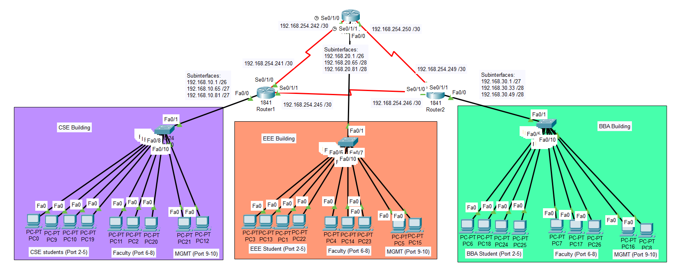
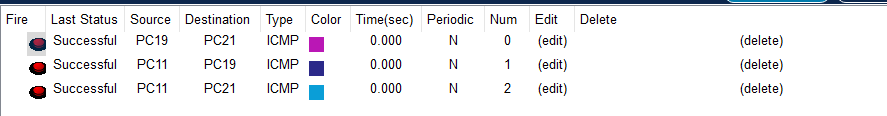
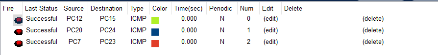
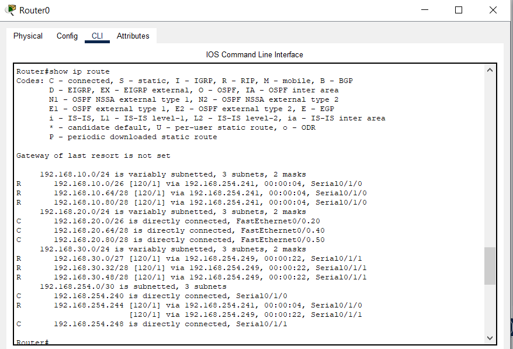
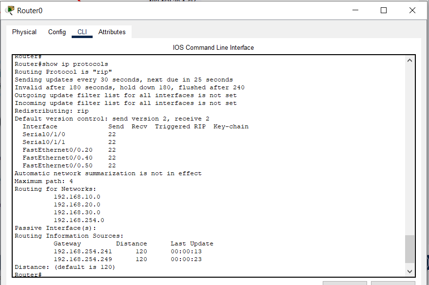
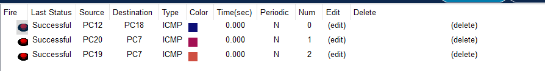

# 🖧 Multi-Router Campus Network Design with VLANs, VLSM & RIP Routing

## Overview

This project demonstrates the design and implementation of a multi-building campus network using VLAN segmentation, VLSM subnetting, router-on-a-stick (inter-VLAN routing), and RIP v2 dynamic routing.

The network consists of three buildings:

* CSE
* EEE
* BBA

Each building is connected using a triangular router topology with redundant paths for resilience.

---

## Objectives

* Design a segmented network using VLANs
* Apply VLSM for efficient IP allocation
* Enable inter-VLAN communication using router-on-a-stick
* Configure RIP v2 for inter-building routing
* Verify connectivity and network resilience

---

## 🏗️ Network Design

## 🗺️ Network Topology



---

### 🔹 VLAN Structure

| VLAN | Department   |
| ---- | ------------ |
| 10   | CSE Students |
| 20   | EEE Students |
| 30   | BBA Students |
| 40   | Faculty      |
| 50   | Management   |

---

### 🔹 IP Addressing (VLSM)

#### CSE (192.168.10.0/24)

* VLAN 10 → /26
* VLAN 40 → /28
* VLAN 50 → /28

#### EEE (192.168.20.0/24)

* VLAN 20 → /26
* VLAN 40 → /28
* VLAN 50 → /28

#### BBA (192.168.30.0/24)

* VLAN 30 → /27
* VLAN 40 → /28
* VLAN 50 → /28

#### Backbone Links

* 192.168.254.0/24 divided into /30 subnets

---

## ⚙️ Technologies Used

* Cisco Packet Tracer
* VLAN (IEEE 802.1Q)
* Router-on-a-Stick
* RIP Version 2
* VLSM Subnetting

---

## 🔧 Configuration Highlights

### VLAN Configuration (Switch)

```bash
vlan 10
vlan 40
vlan 50

interface fa0/x
switchport mode access
switchport access vlan X

interface fa0/24
switchport mode trunk
```

---

### Router-on-a-Stick

```bash
interface fa0/0.10
encapsulation dot1Q 10
ip address 192.168.10.1 255.255.255.192
```

---

### RIP Routing

```bash
router rip
version 2
no auto-summary

network 192.168.10.0
network 192.168.20.0
network 192.168.30.0
network 192.168.254.0
```

---

## ✅ Verification & Testing

### 🔹 Intra-VLAN Connectivity

Devices within the same VLAN successfully communicate.


---

### 🔹 Inter-VLAN Communication

Devices in different VLANs communicate via router.



---

### 🔹 Inter-Building Connectivity

Devices across buildings successfully communicate via RIP routing.



---

### 🔹 Routing Table Verification

```bash
show ip route
```



---

### 🔹 RIP Configuration Verification

```bash
show ip protocols
```



---

## 🔁 Resilience Test

One backbone link was manually disabled to simulate failure:

```bash
interface s0/0/0
shutdown
```

✔ Network remained operational using alternate path
✔ RIP successfully converged



---

## Key Points of My Learnings

* VLANs provide logical segmentation
* Inter-VLAN communication requires Layer 3 routing
* VLSM optimizes IP usage
* RIP enables dynamic route exchange
* Redundant topology improves network reliability

---

## 📸 Project Screenshots

All screenshots are stored in the `/images` folder.

---

## 👨‍💻 Author

**Md. Ekhtiar Hossain**
